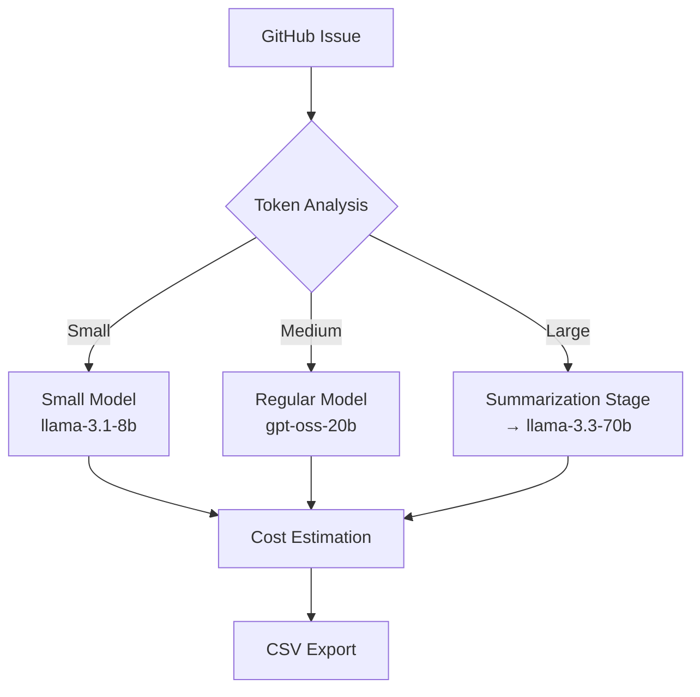

# TaskIQ 🚀  

**AI-Powered GitHub Issue Analysis with Multi-Stage Cost Estimation**

TaskIQ transforms GitHub issues into actionable, cost-estimated development tasks using an **intelligent multi-stage AI pipeline** — combining speed, cost-efficiency, and accuracy.


---

## 🎯 What Makes TaskIQ Different

TaskIQ uses a **multi-stage AI routing system** that intelligently balances performance and cost:

- 🤖 **Adaptive AI Routing** — Automatically assigns the best model based on issue complexity  
- 💰 **Cost-Efficient Scaling** — Uses affordable models for simple tasks, powerful ones for complex issues  
- 🧠 **Context Preservation** — Summarizes large issues without losing important details  
- ⚡ **Accuracy Amplification** — Layered analysis for reliable technical and cost insights  

### 🥇 Competitive Advantage

| Feature | **TaskIQ** | **Competitors** |
|---------|-------------|----------------|
| **AI Model Selection** | ✅ Adaptive routing by issue complexity | ❌ One-size-fits-all |
| **Cost Optimization** | ✅ Dynamically selects cheaper models | ❌ Always uses expensive models |
| **Large Issue Handling** | ✅ Automatic summarization pipeline | ❌ Fails on large issues |
| **Accuracy** | ✅ Multi-stage contextual analysis | ❌ Single-pass approximation |
| **Transparency** | ✅ Full cost and reasoning logs | ❌ Black box approach |

---

## 🚀 Quick Start

### Prerequisites
- Node.js 18+
- [Groq / OpenAI-Compatible API Key](https://console.groq.com/keys)

### Installation

```bash
# Clone repository
git clone https://github.com/rferrari/TaskIQ.git
cd TaskIQ

# Install dependencies
pnpm install

# Setup environment
cp sample-env.txt .env.local
````

### Configuration

Edit `.env.local`:

```bash
# Groq API Configuration
OPENAI_API_KEY=your_groq_api_key_here
OPENAI_BASE_URL=https://api.groq.com/openai/v1

# Model Strategy
SMALL_MODEL=llama-3.1-8b-instant
REGULAR_MODEL=openai/gpt-oss-20b
LARGE_MODEL=llama-3.3-70b-versatile

# Tuning Parameters
SUMMARY_TARGET_TOKENS=1500
ANALYSIS_MAX_TOKENS=2000
```

### Running the App

```bash
# Development mode
pnpm run dev

# Production
pnpm run build
pnpm start
```

Then open [http://localhost:3000](http://localhost:3000) and input any GitHub repo URL!

---

## 🏗️ How It Works

### 🧩 Intelligent Multi-Stage Pipeline



**Stage Breakdown:**

1. **Routing & Cost Prediction** — Detects issue size and selects optimal model.
2. **Context Optimization** — Summarizes or expands context based on complexity.
3. **Specialized Analysis** — Performs cost, complexity, and effort estimation.

---

## 📊 Output Example

### CSV Export

```csv
issue_number,title,complexity,estimated_cost,labels,url
50,"Finish profile metadata edits",3,"$500-$750","enhancement,ui","https://github.com/org/repo/issues/50"
45,"Add comment deletion feature",2,"$250-$500","feature,api","https://github.com/org/repo/issues/45"
```

**Each Analysis Includes:**

* Complexity score (1–5)
* Cost estimate range
* Issue category (bug, feature, etc.)
* Confidence level
* Direct GitHub link

---

## 💡 Use Cases

### 👨‍💻 Development Teams

* Sprint & backlog planning
* Automated effort estimation
* Issue prioritization

### 📋 Project Managers

* Client proposals with transparent AI-backed estimates
* Budget forecasting and progress tracking

### 🌍 Open Source Maintainers

* Bounty and roadmap planning
* Contributor guidance through issue difficulty visualization

---

## 🛠️ Technical Architecture

### Core Interface

```typescript
interface AnalysisPipeline {
  routeIssue(issue: GitHubIssue): AnalysisStrategy;
  createSummary(issue: GitHubIssue): Promise<string>;
  analyzeWithModel(model: string, summary: string): Promise<AIModelResponse>;
  generateCSV(issues: AnalyzedIssue[]): string;
}
```

### Model Overview

| Model                | Speed       | Cost (Input) | Best For                     |
| -------------------- | ----------- | ------------ | ---------------------------- |
| llama-3.1-8b-instant | ⚡ 560 T/s   | 💲0.05/1M    | Simple tasks                 |
| gpt-oss-20b          | ⚙️ 1000 T/s | 💲0.075/1M   | Mid-level issues             |
| llama-3.3-70b        | 🧠 280 T/s  | 💲0.59/1M    | Complex, contextual analysis |

**Performance**

* ⏱ Avg. 2–5s per issue
* 💵 $0.0001–$0.001 per issue
* 🎯 ~85% human parity in estimation accuracy

---

## 🔧 Advanced Configuration

```bash
# Example .env.local (advanced tuning)
SMALL_MODEL=meta-llama/llama-3.2-1b-preview
REGULAR_MODEL=llama-3.1-8b-instant
LARGE_MODEL=mixtral-8x7b-32768

SUMMARY_TARGET_TOKENS=1000
ANALYSIS_MAX_TOKENS=3000
MAX_ISSUE_TOKENS=50000
BATCH_SIZE=5
REQUEST_DELAY=200
```

### API Endpoint

```http
POST /api/analyze
Content-Type: application/json
{
  "repoUrl": "https://github.com/owner/repo"
}
```

Response:

```json
{
  "issues": [...],
  "summary": {
    "total_issues": 45,
    "total_budget_min": 12500,
    "total_budget_max": 28750,
    "complexity_distribution": {"1":5,"2":15,"3":20,"4":4,"5":1},
    "average_confidence": 0.87
  }
}
```

---

## 🚀 Deployment

### Deploy on Vercel

```bash
pnpm i -g vercel
vercel --prod
```

**Environment Variables:**

```bash
OPENAI_API_KEY=groq_xxxxxxxxxxxxxxxxx
OPENAI_BASE_URL=https://api.groq.com/openai/v1
SMALL_MODEL=llama-3.1-8b-instant
REGULAR_MODEL=openai/gpt-oss-20b
LARGE_MODEL=llama-3.3-70b-versatile
```

---

## 💸 Cost Management

| Project Type | Issues | Estimated Cost |
| ------------ | ------ | -------------- |
| Small        | 50     | ~$0.05         |
| Medium       | 200    | ~$0.20         |
| Large        | 1000   | ~$1.00         |

**Optimization Tips**

1. Use smaller default models when possible
2. Reduce `SUMMARY_TARGET_TOKENS` for faster runs
3. Cache analyzed results
4. Batch analyze repositories

---

## 🤝 Contributing

We welcome all contributions!

```bash
# Fork and run locally
git clone https://github.com/rferrari/TaskIQ.git
cd TaskIQ
pnpm install
pnpm run dev
```

**Areas to Contribute**

* 🧠 Model integration (new AI providers)
* 💡 Improved cost/complexity algorithms
* 🎨 UI/UX enhancements
* 🔌 Tool integrations (Jira, Linear, Trello)
* ⚙️ Performance optimization

---

## 📜 License

Released under the **MIT License**.

---

## 🙏 Acknowledgments

* **Groq** — high-speed inference layer
* **GitHub API** — issue data backbone
* **Next.js + Vercel** — deployment simplicity
* **Open Source Community** — inspiration & feedback

---

## 🧠 AI Reasoning Transparency

TaskIQ introduces an **AI Reasoning Modal** — allowing full visibility into the AI’s decision-making process.

### 🔍 Example Output

```json
{
  "complexity": 4,
  "estimated_cost": "$1000–$1500",
  "category": "feature",
  "confidence": 0.8,
  "key_factors": [
    "Integration with external API (Skatehive Leaderboard)",
    "Custom strategy for Snapshot",
    "DAO interface in Skatehive App",
    "Testing and documentation"
  ],
  "potential_risks": [
    "API changes or downtime",
    "Snapshot strategy misconfiguration",
    "Wallet access and voting logic issues"
  ],
  "recommended_actions": [
    "Test API integrations regularly",
    "Monitor Snapshot strategy settings",
    "Ensure clear documentation"
  ],
  "ai_analysis": "This feature requires external API integration, custom Snapshot strategy, and DAO interface work, which increases complexity."
}
```

### 🪄 Why It Matters

* **Transparency** — Understand *why* AI made its estimate
* **Trust** — Justify costs for clients or bounty programs
* **Learning** — See how AI interprets development effort
* **Quality Control** — Spot inconsistent or flawed analyses

---

### ✨ **TaskIQ**

*Transforming GitHub issues into actionable, cost-optimized insights powered by AI.*
